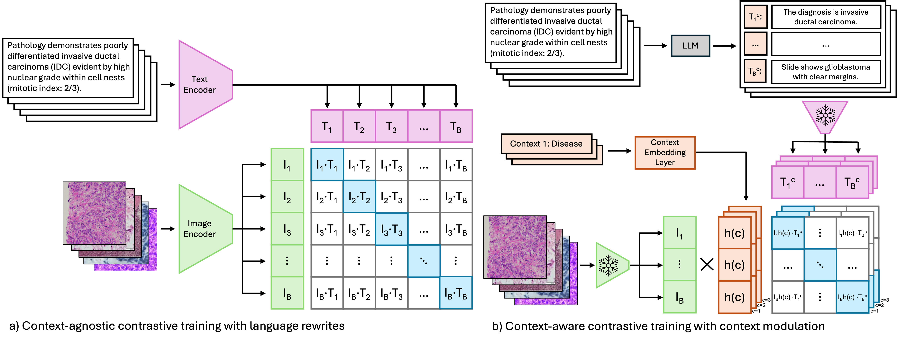
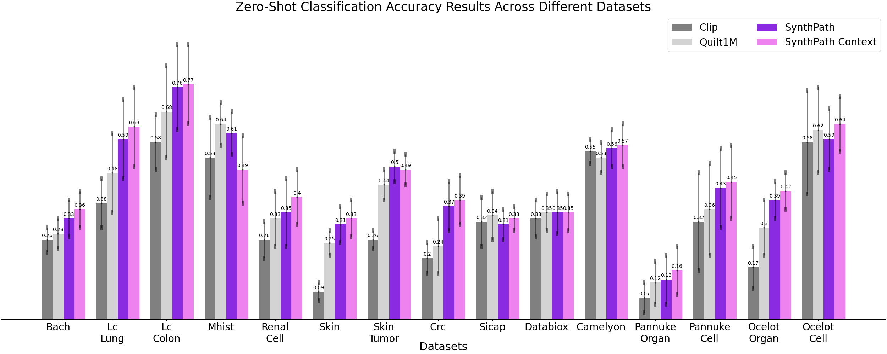

## **SynthPath: LLM-Generated Rewrite and Context Modulation for Enhanced Vision-Language Models in Digital Pathology**

[](LICENSE)  
[](https://www.python.org/)  
[](https://pytorch.org/)  
[](https://github.com/cagladbahadir/synthpath)

---


### **Overview**
This repository contains the codebase, datasets, and models related to the paper:

> **LLM-generated Rewrite and Context Modulation for Enhanced Vision Language Models in Digital Pathology (WACV 2025, Oral Presentation)**  
> *Cagla Deniz Bahadir [1, 2], Gozde B. Akar [3], Mert R. Sabuncu [1,2,4]*  
> [1. Cornell University, 2. Cornell Tech, 3. Middle East Technical University, 4. Weill Cornell Medicine]
> 
> [Paper](https://openaccess.thecvf.com/content/WACV2025/papers/Bahadir_LLM-Generated_Rewrite_and_Context_Modulation_for_Enhanced_Vision_Language_Models_WACV_2025_paper.pdf)  
> [Supplementary Materials](https://openaccess.thecvf.com/content/WACV2025/supplemental/Bahadir_LLM-Generated_Rewrite_and_WACV_2025_supplemental.pdf)
 
**Abstract:**  
We present a novel framework that leverages **Large Language Models (LLMs)** to enrich pathology datasets with **synthetic caption rewrites** and **context modulation**. Our approach improves **zero-shot classification**, **text-to-image retrieval**, and **image-to-text retrieval** in **digital pathology Vision-Language Models (VLMs)**. This repository provides:
- **SynthPath**: A model trained with **synthetic captions** for improved accuracy.
- **SynthPath Context**: A model incorporating **context modulation** for better feature alignment.
- **Largest Digital Pathology Dataset**: 8 million captions and 170K zero-shot classification prompts.

---

## **Repository Structure**
```
├── data/                           
│   ├── test_prompt/                # Test prompts for evaluation
│   │   ├── Mistral_long_prompts/   # Mistral long prompts for testing
│   │   │   ├── bach/ 
│   │   │   ├── mhist/ 
│   │   │   ├── camelyon/ 
│   │   │   ...
│   │   ├── Mistral_short_prompts/  # Mistral short prompts for testing
│   ├── test_set/                   # Test datasets
│   │   ├── ICIAR_BACH/             # Bach dataset for testing
│   │   ├── MHIST/                  # Mhist dataset for testing
│   │   ├── PatchCamelyon/          # Camelyon dataset for testing
│   │   ...
│   ├── train_set/                  # Training datasets
│   │   ├── synth_path_general/     # General rewrites dataset for training
│   │   ├── synth_path_cell/        # Cell context rewrites dataset for training
│   │   ├── synth_path_organ/       # Organ context rewrites dataset for training
│   │   ├── synth_path_disease/     # Disease context rewrites dataset for training
├── src/                            # Source code and utilities
│   ├── dataloaders/                # Data loading scripts
│   │   ├── mhist/                  # Mhist dataloader
├── weights/                        # Pretrained model weights
│   ├── synth_path_checkpoint.pt    # Checkpoint file for trained model
├── results/                        # Results
├── configuration.py                # Configuration file for training parameters
├── README.md                       # Project documentation
├── LICENSE                         # License details
└── requirements.txt                # Dependencies and required packages
```

---

## **Installation**
### **Clone the Repository**
```bash
git clone https://github.com/cagladbahadir/synthpath.git
cd synthpath
```

### **2Install Dependencies**
We recommend using a virtual environment:
```bash
python3 -m venv synthpath_env
source synthpath_env/bin/activate
pip install -r requirements.txt
```

---

## **Dataset & Models**
We provide the **largest publicly available digital pathology dataset**:
- **8 million synthetic captions** for histopathology slides.
- **170K prompt sets** for evaluating zero-shot classification.
- **Pretrained Models**: SynthPath, SynthPath Context

### **🔹 Download Dataset & Models**

**Images**: Please download Quilt1M images from [Quilt1M](https://zenodo.org/records/8239942).

**Captions**: To access the dataset and pretrained models, please **fill out the request form** below:

📄 **[Dataset & Model Access Request Form](https://forms.gle/YOUR-GOOGLE-FORM-LINK)**  

Once approved, you will receive a download link via email.

**Note**: The unfiltered/raw versions of the language rewrites are provided. During training, these rewrites were edited to fit within token size limits and to remove phrases like "here is your answer," among other adjustments.

**Test Datasets**: To download test sets please refer to the paper and download from source. Test set folder structure is provided in repository structure.

**Test Prompts**: Test prompts are already located in data/test_prompts.

---

## *Usage**
### **Creating Language Rewrites with Mistral**

>**mistral/mistral_language_rewrites.py** contains prompts used for generating general and context specific rewrites on the Quilt1M dataset.

**Creating Test Prompts with Mistral**
>**mistral/mistral_prompt_generate.py** calls message templates in mistral folder to create test prompt sets.

### **Zero-Shot Classification**

> Sample python command for zero-shot classification:
```bash
python -u src/zero_shot_classification.py --fixed_embedding [MODEL NAME] --subtype [MODEL ARCHITECTURE] --dataset [DATASET_NAME]  --context_lambda $4
#SynthPath: 
python -u src/zero_shot_classification.py --fixed_embedding 'synth_net' --subtype 'B-32' --dataset 'bach'  --context_lambda 0
#SynthPath Context: 
python -u src/zero_shot_classification.py --fixed_embedding 'synth_net' --subtype 'B-32' --dataset 'bach'  --context_lambda 1
#Quilt: 
python -u src/zero_shot_classification.py --fixed_embedding 'quilt' --subtype 'B-32' --dataset 'bach'  --context_lambda 0
#Clip: 
python -u src/zero_shot_classification.py --fixed_embedding 'clip' --subtype 'ViT-B/32' --dataset 'bach'  --context_lambda 0
```
---

## **Results**
### **Zero-Shot Classification Performance**
- SynthPath improved accuracy across **11 out of 15 datasets**.
- **Statistical significance tests** confirmed the robustness of LLM-generated captions.

**Visualization of Model Performance:**


---

## **Key Features**
**Largest Public Pathology Dataset**: 8M captions, 170K prompts  
**LLM-Augmented Caption Generation**: Enhanced diversity & accuracy  
**Context-Aware Learning**: Embedding adaptation for different pathology contexts  
**Zero-Shot Robustness**: Improved generalization across datasets  
**Open-Source & Reproducible**: Code, models, and dataset available  

---

## **Citation**
If you use this repository or dataset, please cite:
```bibtex
@InProceedings{Bahadir_2025_WACV,
    author    = {Bahadir, Cagla Deniz and Akar, Gozde B. and Sabuncu, Mert R.},
    title     = {LLM-Generated Rewrite and Context Modulation for Enhanced Vision Language Models in Digital Pathology},
    booktitle = {Proceedings of the Winter Conference on Applications of Computer Vision (WACV)},
    month     = {February},
    year      = {2025},
    pages     = {327-336}
}
```

---

## **Contributing**
We welcome contributions! If you'd like to contribute:
1. Fork the repository.
2. Create a new branch (`git checkout -b feature-new-feature`).
3. Commit your changes (`git commit -m "Add new feature"`).
4. Push to the branch (`git push origin feature-new-feature`).
5. Open a Pull Request.

---

## **Contact**
For questions or collaborations, reach out to:
- **Cagla Deniz Bahadir** - cdb232@cornell.edu

